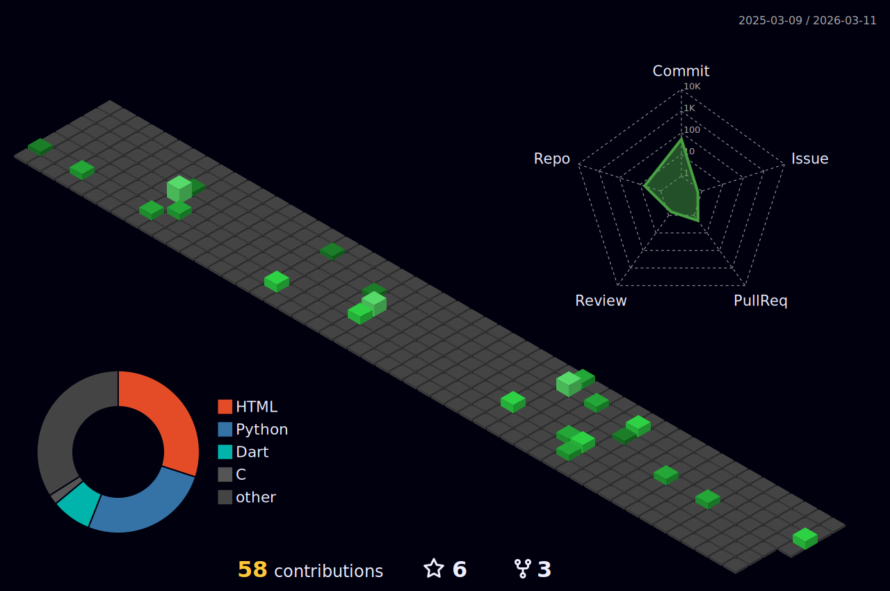

# 👋 Hi! I'm **Felipe Dutra**

🎓 *Computer Science Student | 4th Semester*

---

## 🛠️ Technologies & Tools

---

## 🌱 I’m currently learning

- 🖥️ Computer Architecture  
- 🌐 Computer Network  
- 🖼️ Image Processing  
- 🤖 Artificial Intelligence  
- ⚡ Electronics and Circuits  

---

## 🎖️ Certificates

 
Ethical Hacker - CISCO 

---

## 💬 Contact

