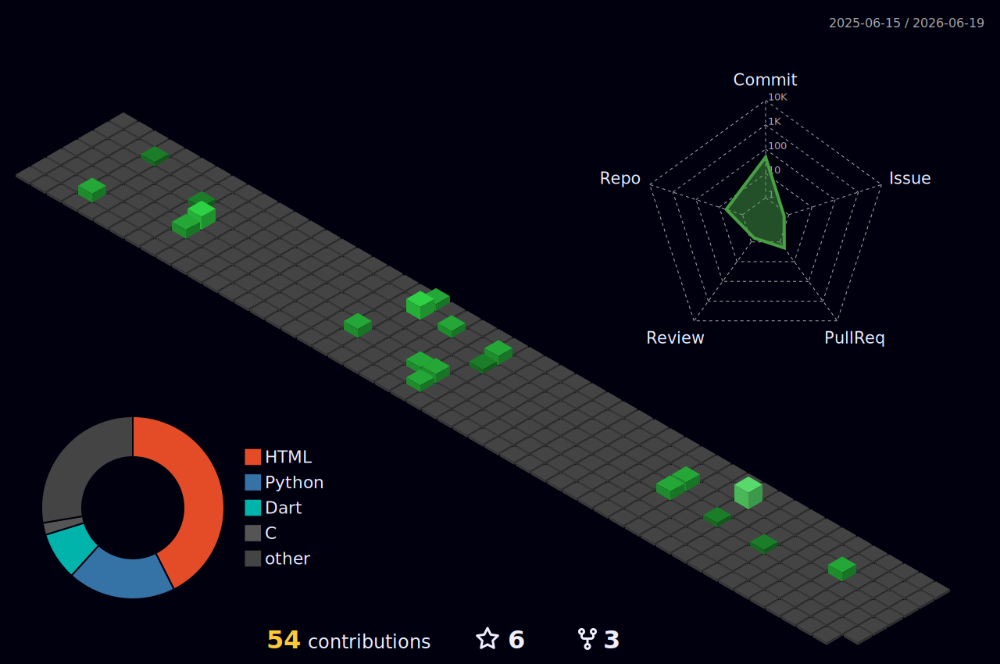

# 👋 Hi! I'm **Felipe Dutra**

🎓 *Computer Science Student | 6th Semester*

---

## 🛠️ Technologies & Tools

---

## 🌱 I’m currently learning

- 🧠 AI
- ☁️ AWS
- 💻 Operating Systems
- 🛡️ Cybersecurity
- ⚙️ Compiler

---

## 🎖️ Certificates

|  |  | 
| :---: | :---: | :---: |
| **Ethical Hacker** Cisco | **Cloud Practitioner** AWS | **Intro to Cybersecurity** Cisco

---

## 💬 Contact

